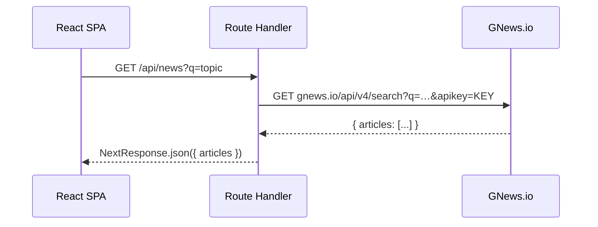
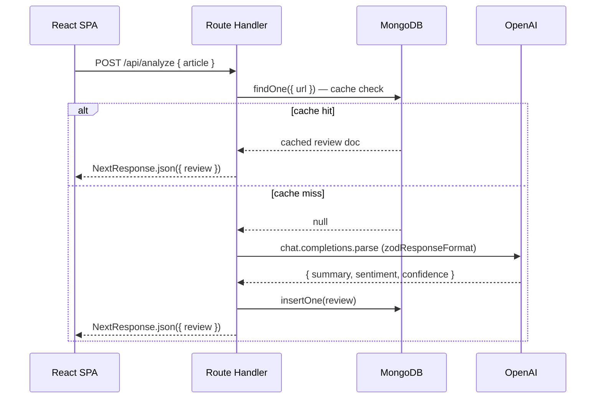
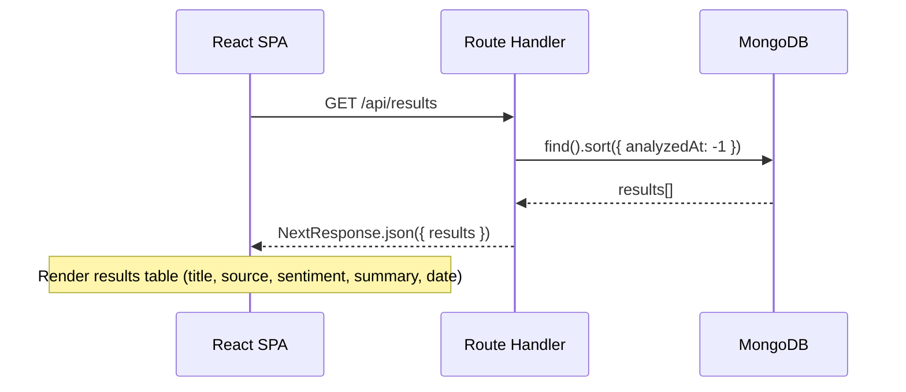

# Smart Reviewer — Implementation Plan

> News sentiment analysis SPA: Next.js (App Router), MongoDB Atlas, GNews, OpenAI.
> Full [assignment](../assignment/assignment.md) · [architecture](./architecture.html) for layer diagram and MongoDB schema.

---

## Todo List

- [x] **Phase 0: Setup**
  - [x] Scaffold Next.js project (`npx create-next-app@latest`)
  - [x] Atlas CLI: create cluster + get connection string
  - [x] Create `.env.local` with all 3 keys
  - [x] `npm install openai zod mongodb`
  - [x] `vercel link` + add env vars
- [ ] **Phase 1: Route Handlers**
  - [ ] `lib/mongodb.js` — MongoClient singleton
  - [ ] `lib/openai.js` — analyzeArticle with zodResponseFormat
  - [ ] `app/api/news/route.js` — GNews proxy
  - [ ] `app/api/analyze/route.js` — OpenAI + cache + save
  - [ ] `app/api/results/route.js` — MongoDB query
  - [ ] Test all 3 routes with curl
- [ ] **Phase 2: Frontend**
  - [ ] `app/globals.css` — design system
  - [ ] `app/layout.jsx` + `app/page.jsx`
  - [ ] `SearchBar.jsx` + `ArticleList.jsx` + `ArticleCard.jsx`
  - [ ] `AnalysisView.jsx` (sentiment badge)
  - [ ] `ResultsTable.jsx`
  - [ ] `Spinner.jsx` + loading/error states
- [ ] **Phase 3: Deploy**
  - [ ] Verify locally with `vercel dev`
  - [ ] Push to `main` → Vercel auto-deploys
  - [ ] Test production URL end-to-end
  - [ ] Update README with setup instructions

---

## Infra Setup

### MongoDB Atlas (via Atlas CLI)

```bash
atlas auth login
atlas clusters create smart-reviewer --provider AWS --region EU_WEST_1 --tier M0
atlas clusters connectionStrings describe smart-reviewer
# → copy the connection string into .env.local as MONGODB_URI
```

### Vercel + GitHub CI/CD

Repo: `https://github.com/felkru/aries_interview.git`

```bash
npm i -g vercel
vercel link                    # link project to Vercel
vercel env add MONGODB_URI     # add secrets (available in all deployments)
vercel env add OPENAI_API_KEY
vercel env add GNEWS_KEY
vercel dev                     # local dev with Vercel runtime
```

**Deployment** is automatic via [Vercel GitHub integration](https://vercel.com/docs/deployments/git/vercel-for-github):

- Every push to `main` → **production deploy**
- Every PR → **preview deploy** with unique URL
- No manual `vercel --prod` needed

---

## Request Flows

### Search Flow



### Analyze Flow (with cache)



### Results Table Flow

> Assignment: *"Store and display a table that is the result of articles that have been summarized."*



---

## Target File Tree

```text
smart-reviewer/
├── package.json                 # next, react, openai, zod, mongodb
├── next.config.js               # [NEW]
├── .env.local                   # MONGODB_URI, OPENAI_API_KEY, GNEWS_KEY
├── .env.example                 # [UPDATE]
│
├── app/                         ──── Next.js App Router ────
│   ├── layout.jsx               # [NEW] root layout, metadata, fonts
│   ├── page.jsx                 # [NEW] main page
│   ├── globals.css              # [NEW] design tokens + styles
│   └── api/                     ──── Route Handlers ────
│       ├── news/route.js        # [NEW] GET → proxy to GNews
│       ├── analyze/route.js     # [NEW] POST → OpenAI + Mongo
│       └── results/route.js     # [NEW] GET → stored analyses from Mongo
│
├── components/                  ──── Client Components ────
│   ├── SearchBar.jsx            # [NEW]
│   ├── ArticleList.jsx          # [NEW]
│   ├── ArticleCard.jsx          # [NEW]
│   ├── AnalysisView.jsx         # [NEW] summary + sentiment badge
│   ├── ResultsTable.jsx         # [NEW] displays stored analyses (assignment req)
│   └── Spinner.jsx              # [NEW]
│
└── lib/                         ──── Shared Server Utils ────
    ├── mongodb.js               # [NEW] MongoClient singleton
    └── openai.js                # [NEW] analyzeArticle() w/ zodResponseFormat
```

---

## Prompt Engineering — Article Analysis

### Goal

Given a news article's metadata and content, produce a structured review containing a neutral summary (2-3 sentences), a sentiment label, and a confidence score — in a single API call.

### System Prompt

```text
You are an expert news analyst. Given a news article, analyze it and provide:
1. A neutral, factual summary in 2-3 sentences
2. The overall sentiment of the article
3. Your confidence in the sentiment assessment (0-1)

Be objective. Do not inject opinion. If the article is ambiguous, lean toward "neutral" and lower your confidence score.
```

**Rationale:** Explicit instructions for neutrality prevent the model from editorializing. The confidence guidance gives a meaningful signal for ambiguous articles rather than forcing a binary choice.

### User Prompt Template

```text
Analyze this news article:

Title: ${article.title}
Source: ${article.source.name}
Published: ${article.publishedAt}
Description: ${article.description}
Full Content: ${article.content}
```

**Rationale:** Including all available fields (title, source, date, description, content) gives the model maximum context. The `source.name` helps the model calibrate for source bias. GNews returns truncated `content` (~260 chars), so `description` provides additional context.

### Output Schema (Zod)

```js
import { z } from 'zod';

const ReviewSchema = z.object({
  summary: z.string(),                                    // 2-3 sentence neutral summary
  sentiment: z.enum(['positive', 'neutral', 'negative']), // categorical label
  confidence: z.number(),                                 // 0-1 score
});
```

### Model & Parameters

| Parameter | Value | Rationale |
| --- | --- | --- |
| `model` | `gpt-4o-mini` | Cheapest model supporting structured outputs; sufficient for sentiment/summarization |
| `temperature` | *(default)* | Default value; no reason to constrain creativity for summarization |
| `response_format` | `zodResponseFormat(ReviewSchema, 'review')` | SDK enforces schema compliance — no parsing failures |

### Parsing Strategy

Uses OpenAI Node SDK's built-in `.parse()` method with `zodResponseFormat()` — returns `message.parsed` directly, no `JSON.parse()` needed.

> Ref: [openai-node helpers.md — Structured Outputs](https://github.com/openai/openai-node/blob/master/helpers.md#auto-parsing-response-content-with-zod-schemas)

```js
const completion = await openai.chat.completions.parse({
  model: 'gpt-4o-mini',
  messages: [systemMessage, userMessage],
  response_format: zodResponseFormat(ReviewSchema, 'review'),
});

const result = completion.choices[0].message.parsed;
// result.summary, result.sentiment, result.confidence — already typed & validated
```

### Edge Cases

| Scenario | Handling |
| --- | --- |
| Refusal (`message.refusal` set) | Return 422 with `{ error: "Analysis refused by model" }` |
| Rate limit (429) | Retry with exponential backoff (OpenAI SDK handles this by default) |
| Malformed output | Impossible with `zodResponseFormat` — SDK throws `LengthFinishReasonError` if truncated |
| Empty/missing article content | Validate request body before calling OpenAI; return 400 |
| Cached article | Skip OpenAI entirely — return stored review from MongoDB |

### Iteration Notes

- **Single-call vs multi-call:** Using one prompt for both summary and sentiment saves an API call per article (assignment: *"minimize the calls you make"*).
- **`json_object` mode vs structured outputs:** Structured outputs with Zod are strictly superior — guaranteed schema compliance, typed parsing, no need for `JSON.parse()` or markdown fence stripping.
- **Temperature:** Left at default — no reason to restrict; summarization benefits from natural phrasing.

---

## Phase Details

### Phase 0 — Setup

| Step | Detail |
| --- | --- |
| `npx create-next-app@latest ./` | App Router, no Tailwind (vanilla CSS), JS |
| Atlas CLI | Create cluster, get connection string |
| `.env.local` | `MONGODB_URI`, `OPENAI_API_KEY`, `GNEWS_KEY` |
| `vercel link` | Link to Vercel, add env vars |

### Phase 1 — Backend (Route Handlers)

| File | Detail |
| --- | --- |
| `lib/mongodb.js` | `MongoClient` singleton (cached in `global` for hot reload) |
| `lib/openai.js` | `analyzeArticle(article)` using prompt strategy above |
| `app/api/news/route.js` | `export async function GET(req)` → fetch GNews, return `NextResponse.json()` |
| `app/api/analyze/route.js` | `export async function POST(req)` → cache check → OpenAI → save → return |
| `app/api/results/route.js` | `export async function GET()` → query MongoDB → return sorted results |

### Phase 2 — Frontend (Components)

| Component | Role |
| --- | --- |
| `app/page.jsx` | Server component shell, renders client components |
| `SearchBar.jsx` | `'use client'` — input + submit → `fetch('/api/news?q=...')` |
| `ArticleCard.jsx` | Title, source, date, "Analyze" button |
| `AnalysisView.jsx` | Summary + sentiment badge (green/grey/red) |
| `ResultsTable.jsx` | `'use client'` — fetches `/api/results` on mount, displays stored analyses |

### Phase 3 — Deploy & Polish

- Error/loading states: every async op shows `<Spinner>`, failures show inline error
- Push to `main` → Vercel deploys automatically
- Verify production URL end-to-end

---

## Verification

**Route handlers (curl via `vercel dev`):**

```bash
curl localhost:3000/api/news?q=test                   # expect { articles: [...] }
curl -X POST localhost:3000/api/analyze \
  -H 'Content-Type: application/json' \
  -d '{"article":{...}}'                              # expect { review: { summary, sentiment, confidence } }
curl localhost:3000/api/results                        # expect { results: [...] }
```

**Browser:** search → cards appear → click Analyze → spinner → sentiment badge → check Results table → refresh → persists from MongoDB.

**Deploy:** push to `main` → Vercel auto-deploys → test the production URL end-to-end.
